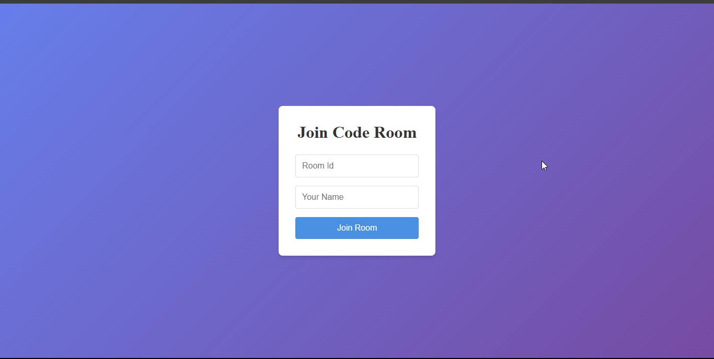

# Code Collaboration Platform

This project is a real-time collaborative coding platform where multiple users can join a shared code room, write code together, and execute the code on the server. It supports multiple programming languages like JavaScript, Python, Java, and C++. The project uses WebSockets for real-time communication and integrates a code execution service to compile and run the code in the selected language.

## Live Demo

You can view the deployed version of the app here: [Code Collaboration Platform - Live Demo](https://codecollab-2vsf.onrender.com)

# CodeCollab Project Demo Video

Click the thumbnail below to watch the demo video of the **CodeCollab** project:

## Technologies Used

- **Backend**: Node.js, Express, Socket.io
- **Frontend**: React, Monaco Editor
- **Code Execution**: Piston API for running code in various languages
- **Version Control**: GitHub

## Features

- **Real-time Collaboration**: Multiple users can join the same room, write code together, and see each other's changes in real time.
- **Code Execution**: Users can run the code in the selected language and view the output in the console.
- **Typing Indicator**: Shows a real-time typing indicator to see who is currently typing.
- **Language Support**: Supports multiple languages such as JavaScript, Python, Java, and C++.
- **Room Management**: Users can create and join rooms, view the list of users in the room, and leave the room.
- **Auto-Reloader**: Periodic reloading of the website every 30 seconds.

